# 🚀 PromptSales - Caso #2 (42%)

## 📝 Descripción
Sistema end-to-end de marketing y ventas con IA. 4 bases de datos especializadas que automatizan desde creación de contenido hasta cierre de ventas. Cada subsistema puede operar independiente pero se integran via MCP servers y ETL.

## 👥 Equipo
| Miembro | BD Asignada | Discord | GitHub | Estado |
|---------|-------------|---------|--------|---------|
| [Nombre 1] | Redis + MongoDB | @user1 | @git1 | Revision⏳ |
| [Nombre 2] | SQL Server (Ads) | @user2 | @git2 | Revision⏳ |
| [Nombre 3] | SQL Server (CRM) | @user3 | @git3 | Revision⏳ |
| [Nombre 4] | PostgreSQL + ETL | @user4 | @git4 | Revision⏳ |

## 📊 Arquitectura

### Vista Simplificada
Flujo principal de datos entre subsistemas:
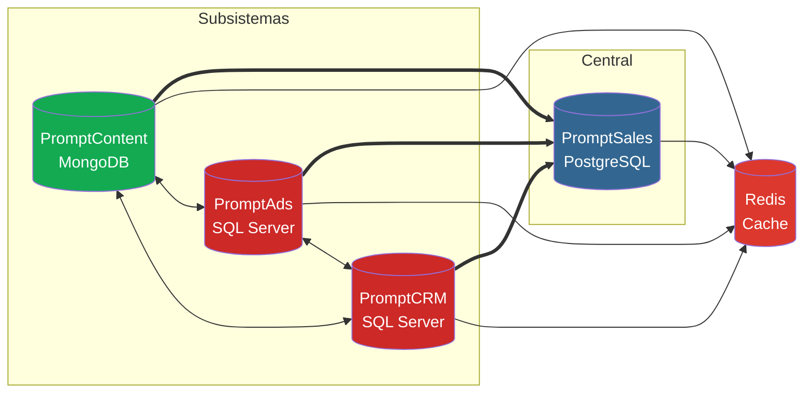

### Vista Detallada
Arquitectura completa incluyendo integraciones externas, ETL, MCP servers y deployment:
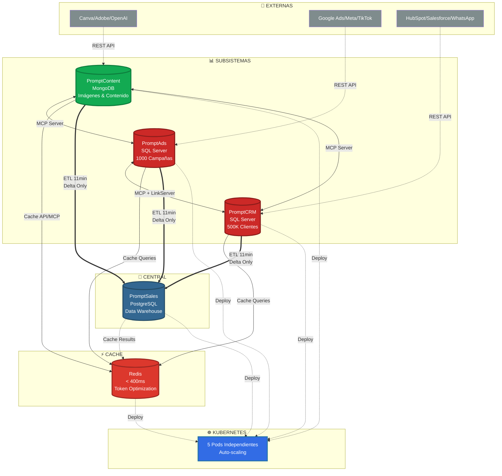

## 🗂️ Bases de Datos

| BD | Motor | Requisitos | Estado |
|----|-------|------------|---------|
| **Redis** | Cache | TTL, Rate limiting | ✅ |
| **PromptContent** | MongoDB | 100 imágenes + vectorización Pinecone | ✅ |
| **PromptAds** | SQL Server | 1000 campañas (30% activas) | ⏳ |
| **PromptCrm** | SQL Server | 500K clientes + X.509 + LinkServer | ⏳ |
| **PromptSales** | PostgreSQL | SSO + ETL deltas | ⏳ |

---

## 📐 Modelos de Datos Completados

### Redis Cache - Estructura de Llaves
**📁 Archivo de diseño:** [redis_design.txt](PromptSales/database/redis/design/redis_design.txt)
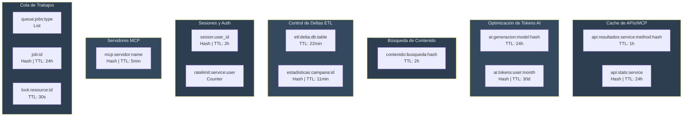

**Patrones de Llaves:**
- Nomenclatura: `{dominio}:{entidad}:{identificador}`
- TTL Estratégico: Según frecuencia de cambio (5min - 30días)
- Cumple: Respuesta < 400ms (reduce a 5-50ms)

---

### MongoDB PromptContent - Colecciones
**📁 Archivo de diseño:** [mongodb_promptcontent_design.js](PromptSales/database/mongodb/design/mongodb_promptcontent_design.js)
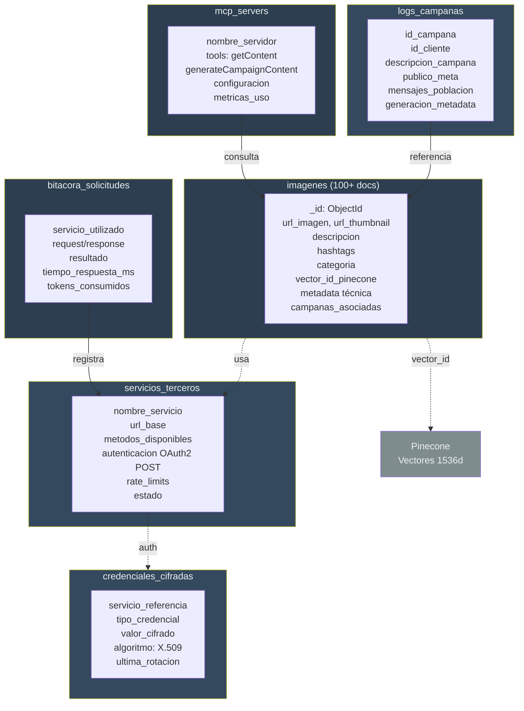

**Decisiones Clave de Diseño:**
- Vectorización: Pinecone (1536 dims) - embeddings en cloud
- Imágenes: URLs a S3/CloudFront - MongoDB solo metadata
- Auth: Canva API con OAuth2 POST (cumple requisito)
- Usuarios: Centralizados en PromptSales PostgreSQL (SSO)
- MCP Tools: getContent (búsqueda semántica) + generateCampaignContent (3 mensajes/población)

---
## PromptSales PostgreSQL - Diagrama ER Completo

### Vista General de Modulos

```mermaid
graph TB
    subgraph AUTH["AUTENTICACION Y USUARIOS"]
        U[Users]
        US[UserSession]
        UP[UserPermissions]
    end
    
    subgraph SUBS["SUSCRIPCIONES Y PLANES"]
        P[Plans]
        PF[PlanFeatures]
        S[Subscriptions]
        SU[SubscriptionUsage]
    end
    
    subgraph PROV["PROVEEDORES Y APIs"]
        PT[ProviderTypes]
        PR[Providers]
        PA[ProviderApis]
        PC[ProviderCredentials]
    end
    
    subgraph CAMP["CAMPANAS CORE"]
        C[Campaigns]
        CO[CampaignObjectives]
        CS[CampaignSchedule]
        CA[CampaignApprovals]
    end
    
    subgraph TARGET["TARGETING Y SEGMENTACION"]
        T[Targets]
        TC[TargetConfiguration]
        POP[PopulationFeatures]
        POPV[PopulationFeatureValues]
    end
    
    subgraph SUMMARY["DATOS SUMARIZADOS ETL"]
        CONT[ContentSummary]
        ADS[AdsSummary]
        CRM[CrmSummary]
        PERF[CampaignPerformance]
    end
    
    subgraph TRANS["TRANSACCIONES Y PAGOS"]
        PM[PaymentMethods]
        TR[Transactions]
        CBT[CampaignBudgetTransactions]
    end
    
    subgraph LOGS["ETL Y AUDITORIA"]
        EW[EtlWatermarks]
        EL[EtlExecutionLogs]
        SL[SystemLogs]
        AL[ApiCallLogs]
    end
    
    U --> US
    U --> UP
    U --> S
    U --> C
    U --> PM
    U --> TR
    U --> SL
    U --> CA
    
    P --> PF
    P --> S
    S --> SU
    PF --> SU
    S --> TR
    
    PT --> PR
    PR --> PA
    PR --> PC
    PR --> PM
    PR --> AL
    
    C --> CO
    C --> CS
    C --> CA
    C --> T
    C --> CBT
    C --> TR
    C --> CONT
    C --> ADS
    C --> CRM
    C --> PERF
    
    T --> TC
    POP --> TC
    POPV --> TC
    POP --> POPV
    
    PM --> TR
    C --> CBT
    
    CONT --> PERF
    ADS --> PERF
    CRM --> PERF
    
    style AUTH fill:#3498db,color:#fff
    style SUBS fill:#9b59b6,color:#fff
    style PROV fill:#e74c3c,color:#fff
    style CAMP fill:#2ecc71,color:#fff
    style TARGET fill:#f39c12,color:#fff
    style SUMMARY fill:#1abc9c,color:#fff
    style TRANS fill:#34495e,color:#fff
    style LOGS fill:#95a5a6,color:#fff
```

---

### Modulo 1: Autenticacion y Usuarios

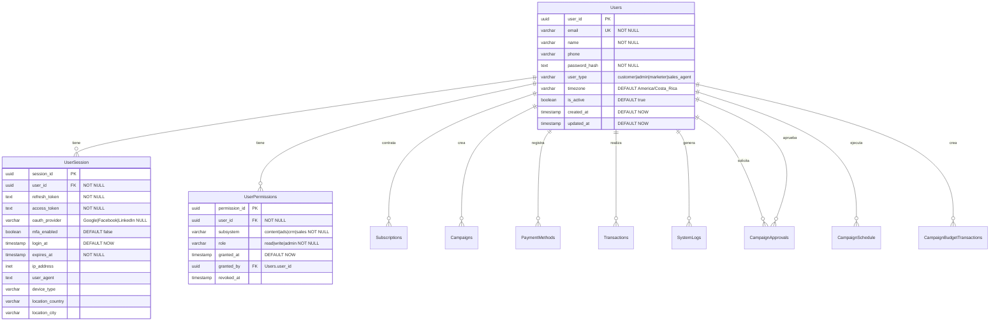

---

### Modulo 2: Suscripciones y Planes

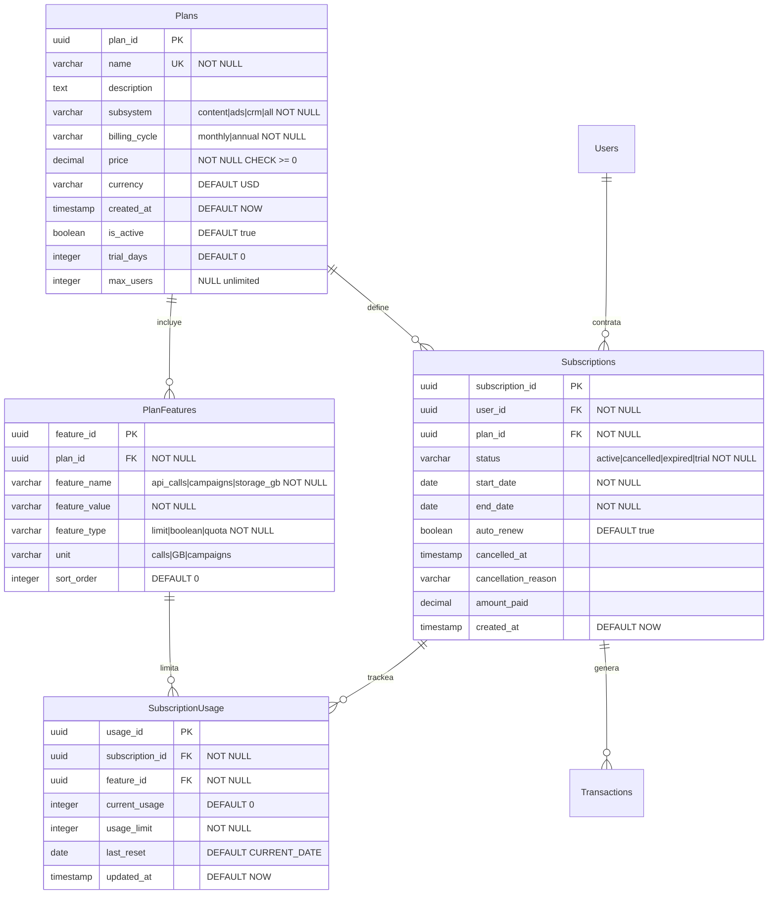

---

### Modulo 3: Proveedores y APIs Externas

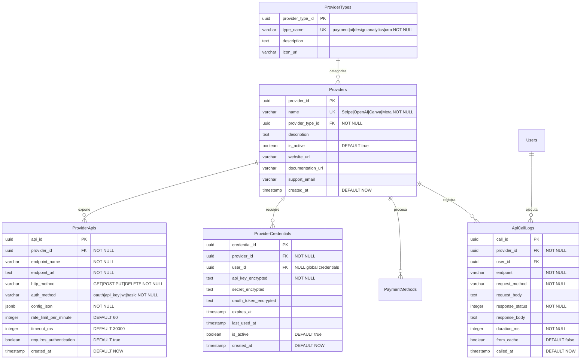

---

### Modulo 4: Campanas Core Business Logic

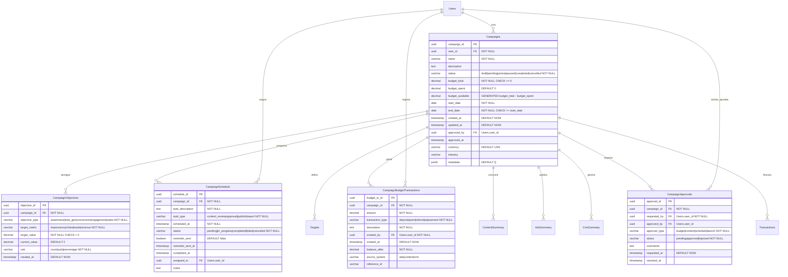

---

### Modulo 5: Targeting y Segmentacion

```mermaid
erDiagram
    Targets ||--o{ TargetConfiguration : "configura"
    PopulationFeatures ||--o{ PopulationFeatureValues : "contiene"
    PopulationFeatures ||--o{ TargetConfiguration : "filtra_por"
    PopulationFeatureValues ||--o{ TargetConfiguration : "especifica"
    Campaigns ||--o{ Targets : "define"
    
    Targets {
        uuid target_id PK
        uuid campaign_id FK "NOT NULL"
        varchar name "NOT NULL"
        text description
        boolean is_enabled "DEFAULT true"
        integer estimated_reach
        timestamp created_at "DEFAULT NOW"
        timestamp updated_at "DEFAULT NOW"
    }
    
    TargetConfiguration {
        uuid config_id PK
        uuid target_id FK "NOT NULL"
        uuid feature_id FK "PopulationFeatures NOT NULL"
        uuid feature_value_id FK "PopulationFeatureValues NOT NULL"
        timestamp created_at "DEFAULT NOW"
    }
    
    PopulationFeatures {
        uuid feature_id PK
        varchar feature_name UK "country|city|age|gender|profession|education|workplace|interests NOT NULL"
        varchar feature_category "demographic|geographic|psychographic|behavioral NOT NULL"
        varchar data_type "string|integer|date|boolean NOT NULL"
        text description
        boolean is_active "DEFAULT true"
        integer sort_order "DEFAULT 0"
    }
    
    PopulationFeatureValues {
        uuid value_id PK
        uuid feature_id FK "NOT NULL"
        varchar value_type "exact|range|list NOT NULL"
        numeric min_value "for ranges"
        numeric max_value "for ranges"
        varchar exact_value "for exact matches"
        text list_values "JSON array for lists"
        varchar display_name "NOT NULL"
        timestamp created_at "DEFAULT NOW"
    }
```

---

### Modulo 6: Datos Sumarizados desde ETL

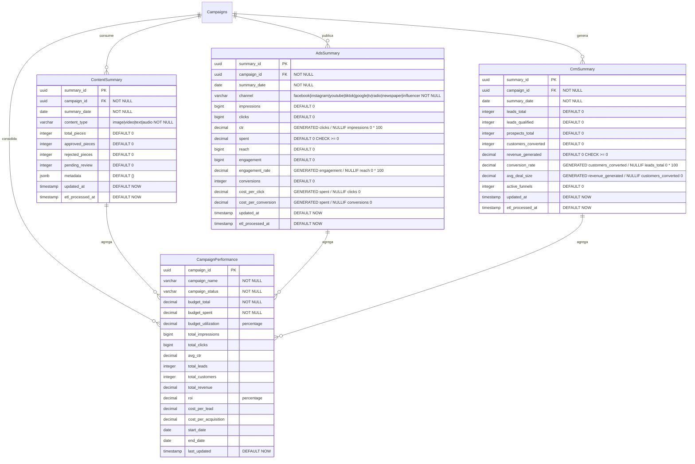

---

### Modulo 7: Transacciones y Pagos

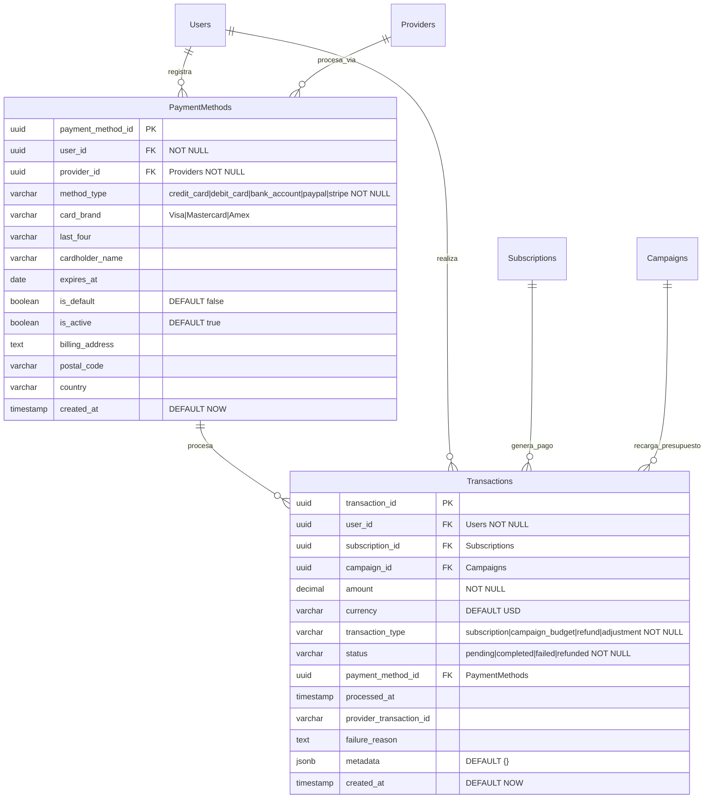

---

### Modulo 8: ETL Control y Auditoria

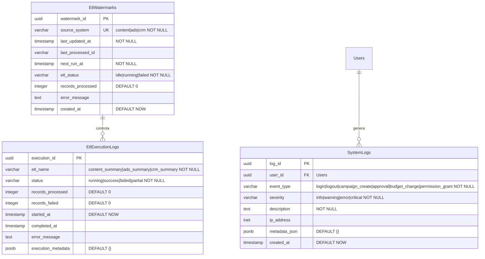

---

### Diagrama ER Completo Integrado

```mermaid
erDiagram
    Users ||--o{ UserSession : ""
    Users ||--o{ UserPermissions : ""
    Users ||--o{ Subscriptions : ""
    Users ||--o{ Campaigns : ""
    Users ||--o{ PaymentMethods : ""
    Users ||--o{ Transactions : ""
    Users ||--o{ SystemLogs : ""
    Users ||--o{ CampaignApprovals : "solicita"
    Users ||--o{ CampaignApprovals : "aprueba"
    
    Plans ||--o{ PlanFeatures : ""
    Plans ||--o{ Subscriptions : ""
    Subscriptions ||--o{ SubscriptionUsage : ""
    PlanFeatures ||--o{ SubscriptionUsage : ""
    Subscriptions ||--o{ Transactions : ""
    
    ProviderTypes ||--o{ Providers : ""
    Providers ||--o{ ProviderApis : ""
    Providers ||--o{ ProviderCredentials : ""
    Providers ||--o{ PaymentMethods : ""
    Providers ||--o{ ApiCallLogs : ""
    
    Campaigns ||--o{ CampaignObjectives : ""
    Campaigns ||--o{ CampaignSchedule : ""
    Campaigns ||--o{ Targets : ""
    Campaigns ||--o{ CampaignBudgetTransactions : ""
    Campaigns ||--o{ ContentSummary : ""
    Campaigns ||--o{ AdsSummary : ""
    Campaigns ||--o{ CrmSummary : ""
    Campaigns ||--o{ CampaignApprovals : ""
    Campaigns ||--o{ Transactions : ""
    Campaigns ||--o{ CampaignPerformance : ""
    
    Targets ||--o{ TargetConfiguration : ""
    PopulationFeatures ||--o{ PopulationFeatureValues : ""
    PopulationFeatures ||--o{ TargetConfiguration : ""
    PopulationFeatureValues ||--o{ TargetConfiguration : ""
    
    PaymentMethods ||--o{ Transactions : ""
    
    EtlWatermarks ||--o{ EtlExecutionLogs : ""
    
    ContentSummary ||--o{ CampaignPerformance : ""
    AdsSummary ||--o{ CampaignPerformance : ""
    CrmSummary ||--o{ CampaignPerformance : ""
    
    Users {
        uuid user_id PK
        varchar email UK
        varchar name
        varchar phone
        text password_hash
        varchar user_type
        varchar timezone
        boolean is_active
        timestamp created_at
        timestamp updated_at
    }
    
    UserSession {
        uuid session_id PK
        uuid user_id FK
        text refresh_token
        text access_token
        varchar oauth_provider
        boolean mfa_enabled
        timestamp login_at
        timestamp expires_at
        inet ip_address
        text user_agent
    }
    
    UserPermissions {
        uuid permission_id PK
        uuid user_id FK
        varchar subsystem
        varchar role
        timestamp granted_at
        uuid granted_by FK
        timestamp revoked_at
    }
    
    Plans {
        uuid plan_id PK
        varchar name UK
        text description
        varchar subsystem
        varchar billing_cycle
        decimal price
        varchar currency
        timestamp created_at
        boolean is_active
        integer trial_days
        integer max_users
    }
    
    PlanFeatures {
        uuid feature_id PK
        uuid plan_id FK
        varchar feature_name
        varchar feature_value
        varchar feature_type
        varchar unit
        integer sort_order
    }
    
    Subscriptions {
        uuid subscription_id PK
        uuid user_id FK
        uuid plan_id FK
        varchar status
        date start_date
        date end_date
        boolean auto_renew
        timestamp cancelled_at
        varchar cancellation_reason
        decimal amount_paid
        timestamp created_at
    }
    
    SubscriptionUsage {
        uuid usage_id PK
        uuid subscription_id FK
        uuid feature_id FK
        integer current_usage
        integer usage_limit
        date last_reset
        timestamp updated_at
    }
    
    ProviderTypes {
        uuid provider_type_id PK
        varchar type_name UK
        text description
        varchar icon_url
    }
    
    Providers {
        uuid provider_id PK
        varchar name UK
        uuid provider_type_id FK
        text description
        boolean is_active
        varchar website_url
        timestamp created_at
    }
    
    ProviderApis {
        uuid api_id PK
        uuid provider_id FK
        varchar endpoint_name
        text endpoint_url
        varchar http_method
        varchar auth_method
        jsonb config_json
        integer rate_limit_per_minute
        integer timeout_ms
        timestamp created_at
    }
    
    ProviderCredentials {
        uuid credential_id PK
        uuid provider_id FK
        uuid user_id FK
        text api_key_encrypted
        text secret_encrypted
        timestamp expires_at
        timestamp last_used_at
        boolean is_active
        timestamp created_at
    }
    
    Campaigns {
        uuid campaign_id PK
        uuid user_id FK
        varchar name
        text description
        varchar status
        decimal budget_total
        decimal budget_spent
        decimal budget_available
        date start_date
        date end_date
        timestamp created_at
        timestamp updated_at
        uuid approved_by FK
        timestamp approved_at
        varchar currency
        varchar industry
        jsonb metadata
    }
    
    CampaignObjectives {
        uuid objective_id PK
        uuid campaign_id FK
        varchar objective_type
        varchar target_metric
        decimal target_value
        decimal current_value
        varchar unit
        timestamp created_at
    }
    
    CampaignSchedule {
        uuid schedule_id PK
        uuid campaign_id FK
        text task_description
        varchar task_type
        timestamp scheduled_at
        varchar status
        boolean reminder_sent
        timestamp completed_at
        uuid assigned_to FK
    }
    
    CampaignApprovals {
        uuid approval_id PK
        uuid campaign_id FK
        uuid requested_by FK
        uuid approved_by FK
        varchar approval_type
        varchar status
        text comments
        timestamp requested_at
        timestamp resolved_at
    }
    
    CampaignBudgetTransactions {
        uuid budget_tx_id PK
        uuid campaign_id FK
        decimal amount
        varchar transaction_type
        text description
        uuid created_by FK
        timestamp created_at
        decimal balance_after
        varchar source_system
        varchar reference_id
    }
    
    Targets {
        uuid target_id PK
        uuid campaign_id FK
        varchar name
        text description
        boolean is_enabled
        integer estimated_reach
        timestamp created_at
        timestamp updated_at
    }
    
    TargetConfiguration {
        uuid config_id PK
        uuid target_id FK
        uuid feature_id FK
        uuid feature_value_id FK
        timestamp created_at
    }
    
    PopulationFeatures {
        uuid feature_id PK
        varchar feature_name UK
        varchar feature_category
        varchar data_type
        text description
        boolean is_active
        integer sort_order
    }
    
    PopulationFeatureValues {
        uuid value_id PK
        uuid feature_id FK
        varchar value_type
        numeric min_value
        numeric max_value
        varchar exact_value
        text list_values
        varchar display_name
        timestamp created_at
    }
    
    ContentSummary {
        uuid summary_id PK
        uuid campaign_id FK
        date summary_date
        varchar content_type
        integer total_pieces
        integer approved_pieces
        integer rejected_pieces
        integer pending_review
        timestamp etl_processed_at
    }
    
    AdsSummary {
        uuid summary_id PK
        uuid campaign_id FK
        date summary_date
        varchar channel
        bigint impressions
        bigint clicks
        decimal ctr
        decimal spent
        bigint reach
        bigint engagement
        integer conversions
        timestamp etl_processed_at
    }
    
    CrmSummary {
        uuid summary_id PK
        uuid campaign_id FK
        date summary_date
        integer leads_total
        integer leads_qualified
        integer prospects_total
        integer customers_converted
        decimal revenue_generated
        decimal conversion_rate
        timestamp etl_processed_at
    }
    
    CampaignPerformance {
        uuid campaign_id PK
        varchar campaign_name
        varchar campaign_status
        decimal budget_total
        decimal budget_spent
        bigint total_impressions
        bigint total_clicks
        decimal avg_ctr
        integer total_leads
        integer total_customers
        decimal total_revenue
        decimal roi
        timestamp last_updated
    }
    
    PaymentMethods {
        uuid payment_method_id PK
        uuid user_id FK
        uuid provider_id FK
        varchar method_type
        varchar card_brand
        varchar last_four
        date expires_at
        boolean is_default
        boolean is_active
        timestamp created_at
    }
    
    Transactions {
        uuid transaction_id PK
        uuid user_id FK
        uuid subscription_id FK
        uuid campaign_id FK
        decimal amount
        varchar currency
        varchar transaction_type
        varchar status
        uuid payment_method_id FK
        timestamp processed_at
        varchar provider_transaction_id
        timestamp created_at
    }
    
    EtlWatermarks {
        uuid watermark_id PK
        varchar source_system UK
        timestamp last_updated_at
        varchar last_processed_id
        timestamp next_run_at
        varchar etl_status
        integer records_processed
        text error_message
    }
    
    EtlExecutionLogs {
        uuid execution_id PK
        varchar etl_name
        varchar status
        integer records_processed
        integer records_failed
        timestamp started_at
        timestamp completed_at
        text error_message
    }
    
    SystemLogs {
        uuid log_id PK
        uuid user_id FK
        varchar event_type
        varchar severity
        text description
        inet ip_address
        timestamp created_at
    }
    
    ApiCallLogs {
        uuid call_id PK
        uuid provider_id FK
        uuid user_id FK
        varchar endpoint
        varchar request_method
        integer response_status
        integer duration_ms
        boolean from_cache
        timestamp called_at
    }
```


# 📁 Estructura del Proyecto

```
PromptSales/
├── README.md                          # Documentación principal del proyecto
├── .gitignore                         # Archivos ignorados por Git
├── docker-compose.yml                 # Configuración de contenedores Docker
├── kubernetes/                        # Archivos de despliegue en Kubernetes
│   ├── mongodb-deployment.yaml       # Configuración para desplegar MongoDB
│   ├── sqlserver-ads-deployment.yaml # Configuración para desplegar SQL Server (Ads)
│   ├── sqlserver-crm-deployment.yaml # Configuración para desplegar SQL Server (CRM)
│   ├── postgresql-deployment.yaml    # Configuración para desplegar PostgreSQL
│   └── redis-deployment.yaml          # Configuración para desplegar Redis
├── database/                          # Bases de datos del sistema
│   ├── mongodb/                      # Base de datos PromptContent
│   │   ├── design/                   # Diseño y esquemas de colecciones
│   │   ├── scripts/                  # Scripts de llenado y mantenimiento
│   │   └── mcp/                      # Servidores MCP para MongoDB
│   ├── sqlserver_ads/                # Base de datos PromptAds
│   │   ├── schema/                   # Esquema de tablas y relaciones
│   │   ├── procedures/               # Procedimientos almacenados
│   │   └── scripts/                  # Scripts de llenado (1000 campañas)
│   ├── sqlserver_crm/                # Base de datos PromptCRM
│   │   ├── schema/                   # Esquema de tablas y relaciones
│   │   ├── security/                 # Configuración de cifrado X.509
│   │   ├── procedures/               # Procedimientos almacenados
│   │   └── scripts/                  # Scripts de llenado (500k clientes)
│   ├── postgresql/                   # Base de datos PromptSales (centralizada)
│   │   ├── schema/                   # Esquema de tablas centralizadas
│   │   ├── etl/                      # Configuración de ETL y deltas
│   │   └── mcp/                      # Servidor MCP para consultas
│   └── redis/                        # Base de datos caché
│       ├── design/                   # Diseño de llaves y TTLs
│       └── config/                   # Configuración de Redis
├── etl/                              # Pipelines de extracción y transformación
│   ├── pentaho/                     # Configuración de Pentaho (herramienta visual)
│   └── documentation/                # Documentación del proceso ETL
├── mcp_servers/                      # Servidores de Model Context Protocol
│   ├── content_generator/           # MCP para generación de contenido
│   ├── ads_optimizer/                # MCP para optimización de anuncios
│   ├── crm_analyzer/                 # MCP para análisis de CRM
│   └── sales_dashboard/              # MCP para dashboard de ventas
├── documentation/                    # Documentación del proyecto
│   ├── AI_USAGE_LOG.md             # Bitácora obligatoria de uso de IA
│   ├── DESIGN_DECISIONS.md         # Decisiones de diseño tomadas
│   └── API_DOCUMENTATION.md        # Documentación de APIs externas
└── tests/                           # Pruebas del sistema
    ├── deadlock_tests/              # Pruebas de interbloqueo (3 niveles)
    ├── performance_tests/           # Pruebas de rendimiento e índices
    └── integration_tests/           # Pruebas de integración entre BDs
```

## 📝 Descripción de Carpetas Principales

### `/database`
Contiene los 5 motores de base de datos del ecosistema:
- **mongodb**: Gestión de contenido multimedia (100+ imágenes)
- **sqlserver_ads**: Campañas publicitarias (1000 registros)
- **sqlserver_crm**: Clientes y ventas (500k registros)
- **postgresql**: Portal centralizado y usuarios
- **redis**: Caché para optimización

### `/kubernetes`
Archivos YAML para orquestación de contenedores, permitiendo despliegue automático de toda la infraestructura.

### `/mcp_servers`
Implementación de servidores MCP (Model Context Protocol) para comunicación entre IA y bases de datos. Mínimo 2 tools por cada BD.

### `/etl`
Pipeline de datos que se ejecuta cada 11 minutos para sincronizar información entre las bases de datos usando herramientas visuales (NO código).

### `/tests`
Pruebas críticas requeridas:
- Deadlock en cascada (3 transacciones)
- Problemas de concurrencia (Dirty Read, Lost Update)
- Comparación de rendimiento con/sin índices

### `/documentation`
- **AI_USAGE_LOG.md**: OBLIGATORIO - registrar TODO uso de IA
- **DESIGN_DECISIONS.md**: Justificar decisiones técnicas
- **API_DOCUMENTATION.md**: Documentar integraciones externas

## ⚠️ Archivos Críticos

| Archivo | Propósito | Prioridad |
|---------|-----------|-----------|
| `AI_USAGE_LOG.md` | Registrar prompts y validaciones | 🔴 CRÍTICO |
| `docker-compose.yml` | Levantar ambiente local | 🟡 IMPORTANTE |
| `.env` | Credenciales y configuración | 🔴 CRÍTICO |
| Scripts de llenado | Generar datos de prueba | 🔴 CRÍTICO |

## ✅ Requisitos Críticos

### Datos
- 100+ imágenes con descripciones y hashtags
- 1000 campañas (picos: dic, ene, +1 mes)
- 500,000 clientes algorítmicos
- Coherencia entre BDs

### Técnicos
- [ ] SP transaccional con TVPs
- [ ] Link Server CRM ↔ Ads
- [ ] Cifrado X.509 (datos sensibles)
- [ ] MCP Server (2 tools/BD)
- [ ] ETL cada 11 min (solo deltas)

### Pruebas
- [ ] Deadlock cascada (3 transacciones)
- [ ] Dirty Read / Lost Update / Incorrect Summary
- [ ] Deadlock 2 PCs diferentes
- [ ] Execution Plan (antes/después índices)
- [ ] Monitoreo rendimiento

### Consultas SQL
**PromptAds**: EXCEPT, INTERSECT, MERGE, LTRIM, LOWERCASE, FLOOR, CEIL, UPDATE-SELECT  
**PromptCrm**: CTE, PARTITION, RANK, distancia geográfica  
**PromptSales**: Triggers, Cursores, COALESCE, CASE, JOINs, GRANT/REVOKE

## 🚀 Quick Start
```bash
git clone [repo] && cd PromptSales
kubectl apply -f kubernetes/
./scripts/load_all.sh
```

## 📅 Fechas
- **28 Oct**: Última revisión diseños
- **16-22 Nov**: Presentación final

## ⚠️ Reglas
1. NO portal web
2. ETL visual (no código)
3. Documentar TODA IA
4. Commits diarios
5. Datos coherentes

## 📝 Bitácora IA (OBLIGATORIO)
| Fecha | Nombre | Prompt | Validación |
|-------|--------|--------|------------|
| 2025-10-27 | Lee-Sang-cheol | Diseñar modelo ER completo PromptSales (PostgreSQL) con 8 módulos: Auth SSO, Suscripciones, Proveedores, Campañas, Targeting, Summaries ETL, Transacciones, Logs | Revisé contra requisitos Caso #2, confirmé cardinalidades, verifiqué tipos de datos PostgreSQL, comparé con apuntes clase |
| 2025-10-29 | Lee-Sang-cheol | Crear scripts SQL: triggers, cursors, deadlock 3-way, queries con COALESCE/CASE/JOINs, metadata, monitoring, GRANT/REVOKE | Probé sintaxis en PostgreSQL 14 local, verifiqué lógica de deadlock circular, confirmé que queries cumplen requisitos |

---
v6.0 | 2025-10-29
